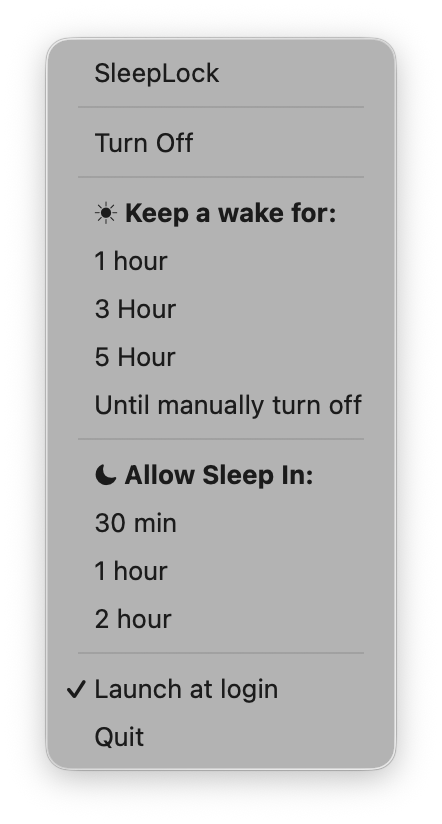

# SleepLock

SleepLock is a native macOS menu bar utility that controls when your Mac is allowed to sleep & when your Mac stays awake.

Current release: `1.3.1` (`build 4`)

## UI Preview



The app is designed as a lightweight system-style tool:
- menu bar only (`LSUIElement = true`)
- no Dock icon
- native AppKit + SwiftUI
- low overhead and simple interaction

## Requirements

- macOS 13+
- Swift 6.2 toolchain
- Xcode with the macOS SDK for Xcode project builds
- Apple Development certificate for local install signing
- Developer ID Application certificate for notarized DMG releases

## Core behavior

SleepLock uses native power activity APIs:
- `ProcessInfo.processInfo.beginActivity(.idleSystemSleepDisabled)`
- `ProcessInfo.processInfo.endActivity(...)`

No shell `caffeinate` process is used.

## Modes

Internal state model:
- `off`
- `keepAwakeInfinite`
- `keepAwakeUntil(Date)`
- `allowSleepAfter(Date)`

### Semantics

- **Keep Awake For**: prevents sleep immediately and keeps Mac awake until timer end.
- **Allow Sleep In**: also prevents sleep immediately for a fixed duration; when timer expires, SleepLock disables its override and requests system sleep.
- **Turn Off**: cancels timers, ends sleep override, returns to neutral behavior.

Timers are absolute wall-clock timers and do not reset based on user activity.

## Menu bar icons

- **Startup / Idle (`off`)**: bundled template-style `IconBarLight.png`.
- **Stay awake infinite**: `sun.max.fill`.
- **Keep awake timer**: `sun.max.fill` + remaining time (`Nh` / `Nm`).
- **Allow sleep timer**: `moon.fill` + remaining time (`Nh` / `Nm`).

All menu bar icons are template monochrome icons and adapt automatically to Light/Dark mode.

## Current menu structure

- `Turn Off`
- `Keep awake for:`
  - `1 hour`
  - `3 hours`
  - `5 hours`
  - `Until manually turned off`
- `Allow Sleep In:`
  - `30 min`
  - `1 hour`
  - `2 hours`
- `Launch at login`
- `Quit`

## UX shortcuts

- `Option + left click` on status item: quick toggle on/off.
- `Right click`: opens full menu.

## Launch at login

The app uses `SMAppService.mainApp` for launch-at-login registration.

## Build and install

Project includes scripts for stable local install/signing workflow and notarized release packaging.

### 1) Generate app icon (`AppIcon.icns`)

```bash
./scripts/generate_app_icon.sh
```

You can pass a custom PNG path:

```bash
./scripts/generate_app_icon.sh ./icon.png
```

### 2) Build and install to `/Applications`

```bash
./scripts/build_and_install_app.sh
```

Output app locations:
- `./dist/SleepLock.app`
- `/Applications/SleepLock.app`

The local install script builds with SwiftPM and signs with an Apple Development identity when available. It bundles `Sources/SleepLock/Resources/IconBarLight.png` and applies `SleepLock.entitlements`.

### 3) Build a signed release DMG

```bash
./scripts/build_release_dmg.sh
```

Release output:
- `./dist/release/SleepLock-1.3.1-4.dmg`

The release script uses `SleepLock.xcodeproj` with `xcodebuild`, creates a Universal 2 app (`x86_64` + `arm64`), signs with Developer ID, creates a DMG, and can submit it to Apple notarization.

To notarize with a saved notarytool profile:

```bash
NOTARIZE=1 NOTARY_KEYCHAIN_PROFILE=SleepLockNotary ./scripts/build_release_dmg.sh
```

The generated release DMG is kept out of git by `.gitignore`.

## Development

### Run tests

```bash
cd .
swift test
```

### Release build

```bash
cd .
swift build -c release
```

SwiftPM release builds are intended for local development. Use `scripts/build_release_dmg.sh` for the distributable Universal 2 package.

## App Store Connect

App Store listing notes and screenshots are tracked in:
- `AppStoreConnect/AppStoreListing.md`
- `AppStoreConnect/Screenshots/SleepLock-AppStore-Preview.png`

Current app metadata:
- Bundle identifier: `com.grigorym.SleepLock`
- Category: `Utilities`
- Sandbox: enabled via `SleepLock.entitlements`

## Repository

GitHub remote:
- [https://github.com/G5023890/SleepLock](https://github.com/G5023890/SleepLock)

## License

This project is licensed under **Apache-2.0**.
See `/Users/grigorymordokhovich/Documents/Develop/SleepLock/LICENSE`.

## Project structure

- `Sources/SleepLock/SleepLockApp.swift`
- `Sources/SleepLock/StatusBarController.swift`
- `Sources/SleepLock/SleepController.swift`
- `Sources/SleepLock/SleepSystemController.swift`
- `Sources/SleepLock/LaunchAtLoginManager.swift`
- `Sources/SleepLock/SleepTimeFormatter.swift`
- `Sources/SleepLock/Resources/IconBarLight.png`
- `SleepLock.xcodeproj/project.pbxproj`
- `SleepLock.entitlements`
- `scripts/build_and_install_app.sh`
- `scripts/build_release_dmg.sh`
- `scripts/generate_app_icon.sh`
